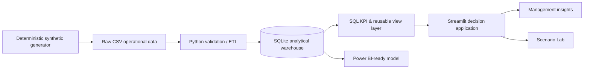

# Manufacturing Intelligence Platform

**Industrial Analytics · Python · SQL · Streamlit · Decision Support**

[](https://github.com/aaronexposito0-creator/manufacturing-intelligence-platform/actions/workflows/ci.yml)

A portfolio-grade manufacturing intelligence product that turns operational data into **traceable decisions**. The platform models a synthetic six-machine factory and connects OEE, production, quality, downtime and manufacturing economics in one interactive application.

> **Data safety:** the entire dataset is deterministic and synthetic. No employer, customer or confidential operational data is used.

## Why this project is different

This is not a collection of disconnected charts. The project is structured around a real industrial analytics workflow:

**raw operational records → validation / ETL → analytical warehouse → governed KPI logic → interactive analysis → quantified actions**

The application deliberately answers management questions such as:

- Which asset is the true production constraint?
- Is the OEE gap driven by availability, performance or quality?
- Which downtime causes offer the highest leverage?
- Where is scrap concentrated by machine and product?
- How does poor efficiency propagate into unit cost and margin?
- What is the approximate value of recovering a constraint asset to target?
- What happens to OEE and contribution under a controlled A/P/Q improvement scenario?

## Product highlights

### Executive decision cockpit
- OEE, availability, quality, plan attainment, unit cost and gross-margin rate.
- **Comparable-period deltas** instead of isolated KPI values.
- Machine health classification: **Healthy / Watch / Critical** against asset-specific OEE targets.
- Weekly / daily / monthly trend granularity.
- Machine OEE versus target.
- Constraint-recovery opportunity sized in **good units/month** and **gross contribution/month**.

### Traceable management insights
The recommendation layer is rules-based and deterministic. Each insight exposes:

1. **Impact** — what the data says.
2. **Likely driver** — where to investigate.
3. **Recommended action** — what to do next.
4. **Estimated opportunity** — why the action matters economically.

No external LLM or black-box API is used in the app.

### Scenario Lab
A what-if model lets a user select an asset and test improvements in:

- Availability
- Performance
- Scrap rate

The model then estimates the new OEE, incremental sellable output, revenue opportunity and gross contribution using the observed product mix and economics.

### Manufacturing analytics depth
- True weighted OEE — never an average of row-level percentages.
- Defect Pareto with cumulative share.
- Weighted machine × product scrap heatmap.
- Downtime Pareto and loss composition.
- Efficiency-versus-unit-cost analysis.
- Product margin analysis.
- Row-level Data Explorer and CSV export.

## Architecture



## Analytical data model

The warehouse uses a compact logical star schema:

- `dim_date`
- `dim_machine`
- `dim_product`
- `fact_production`
- `fact_downtime`
- `fact_quality`

Reusable SQL views:

- `vw_order_kpis`
- `vw_daily_machine_kpis`
- `vw_machine_health`
- `vw_monthly_business_kpis`

## KPI governance

Core calculations are recomputed from additive components in the selected filter context:

- **Availability** = Run Time / Planned Production Time
- **Performance** = (Ideal Cycle Time × Total Count) / Run Time
- **Quality** = Good Count / Total Count
- **OEE** = Availability × Performance × Quality
- **Scrap rate** = Scrap Count / Total Count
- **Plan attainment** = Good Count / Planned Quantity
- **Unit cost** = Production Cost / Good Count
- **Gross-margin rate** = (Revenue − Production Cost) / Revenue

This avoids a common BI failure mode: averaging percentages that require weighted aggregation.

## Synthetic business story

The generator intentionally embeds a coherent operating story:

- `M04` (robotic welding) has chronic availability loss and a worsening 2026 constraint pattern.
- `P06` has a higher intrinsic quality-loss rate and a modest 2026 quality drift.
- Afternoon shift has a small but persistent A/P/Q penalty.
- Demand has mild seasonality, including a lower August loading profile.
- Downtime causes are machine-sensitive; `M04` disproportionately experiences fixture, robot-recovery and welding-related losses.
- Product economics are constructed to produce plausible manufacturing contribution margins rather than artificial 80%+ margins.

The data is reproducible with a fixed seed.

## Quick start

### Windows

1. Install **Python 3.11+**.
2. Extract the repository.
3. Double-click `START_WINDOWS.bat`.
4. Open `http://localhost:8501` if the browser does not open automatically.

### Manual

```bash
python -m venv .venv
```

Windows:
```bash
.venv\Scripts\activate
```

macOS/Linux:
```bash
source .venv/bin/activate
```

Then:

```bash
pip install -r requirements.txt
streamlit run app.py
```

## Reproduce the full dataset and warehouse

```bash
python src/generate_data.py
python src/build_database.py
```

## Quality assurance

```bash
pytest -q
```

The test suite checks:

- weighted KPI logic;
- scenario behaviour;
- quantity conservation (`good + scrap = total`);
- downtime reconciliation to lost planned time;
- quality-defect reconciliation to scrap;
- plausible synthetic economics.

A GitHub Actions workflow rebuilds the warehouse, runs the tests and compiles the Python sources on each push / pull request.

## Repository structure

```text
Manufacturing-Intelligence-Platform/
├── app.py
├── assets/
│   └── custom.css
├── data/
│   ├── raw/
│   ├── processed/manufacturing.db
│   └── DATASET_SUMMARY.json
├── docs/
│   ├── CASE_STUDY.md
│   ├── DATA_DICTIONARY.md
│   ├── DEPLOYMENT.md
│   ├── INTERVIEW_CHEATSHEET.md
│   ├── METRIC_GOVERNANCE.md
│   ├── POWER_BI_GUIDE.md
│   ├── PROJECT_STORY.md
│   └── QA_REPORT.md
├── sql/
│   ├── 01_schema.sql
│   ├── 02_views.sql
│   └── 03_example_analysis.sql
├── src/
│   ├── build_database.py
│   ├── generate_data.py
│   ├── insights.py
│   ├── kpis.py
│   └── scenarios.py
├── tests/
├── .github/workflows/ci.yml
├── powerbi/
│   ├── DAX_Measures.txt
│   └── Manufacturing_Intelligence_Theme.json
├── pyproject.toml
├── requirements.txt
└── START_WINDOWS.bat
```

## Suggested recruiter demo path

If you are reviewing this project as part of a recruitment process:

1. Open **Executive Overview**.
2. Compare `M04` against its OEE target.
3. Read the first Management Insight and its quantified opportunity.
4. Open **Downtime** and inspect the Pareto.
5. Open **Quality** and cross-check the machine × product heatmap.
6. Open **Scenario Lab**, select `M04`, and test an availability recovery.
7. Open **Data Explorer** to verify row-level traceability.

That path demonstrates the full chain from **operational signal → root-cause direction → business impact → decision scenario**.

## What this project demonstrates

- Industrial process understanding, not only chart-building.
- Python data processing and reusable analytics logic.
- SQL analytical modelling and metric centralisation.
- Business-facing KPI design.
- Data quality and reconciliation thinking.
- Interactive decision-support UX.
- Ability to quantify operational opportunities without overstating them.
- Reproducible engineering practices: deterministic data, automated tests and CI.

## Author

**Aarón Expósito**  
Engineering · Product Development · Data & Business Analytics  
LinkedIn: https://www.linkedin.com/in/aaronexpositomonar  
GitHub: https://github.com/aaronexposito0-creator
